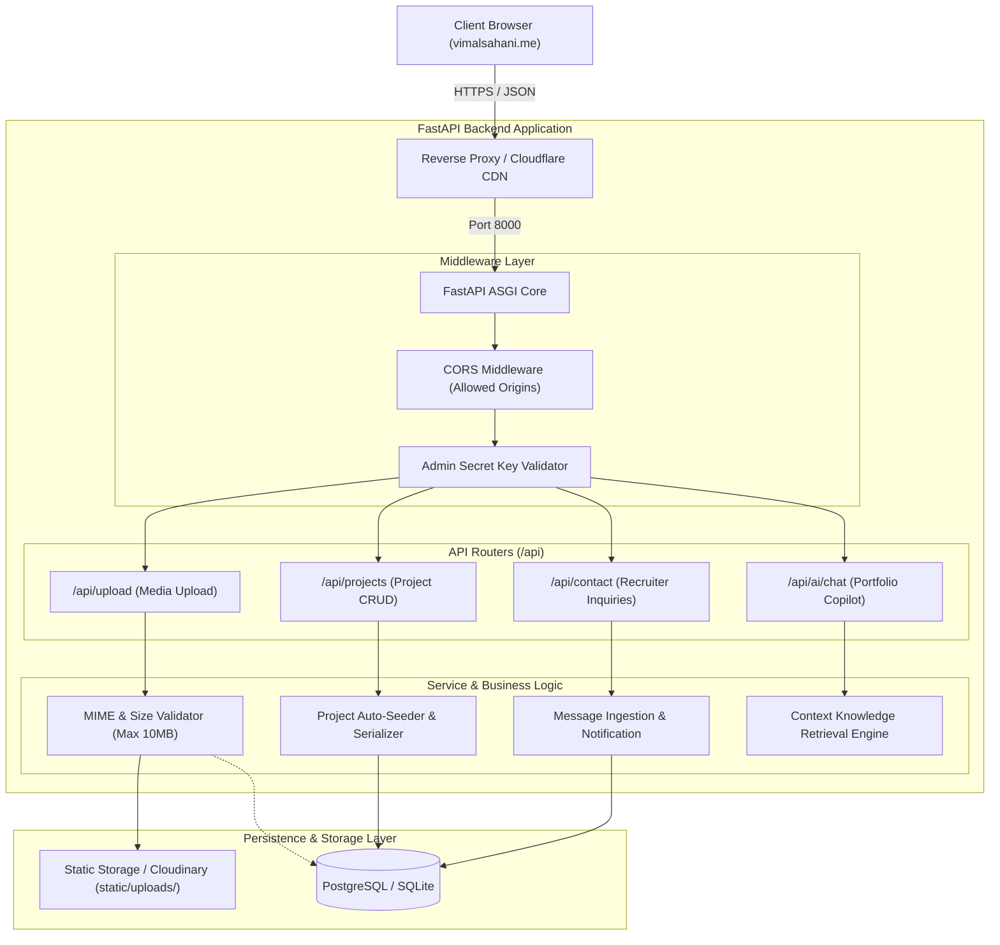
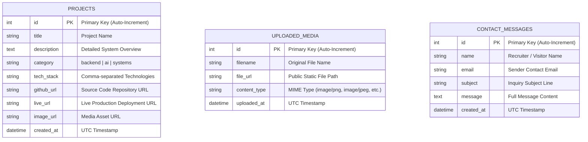

# ⚡ Vimal Sahani — Portfolio Backend API Service

[](https://fastapi.tiangolo.com)
[](https://python.org)
[](https://www.sqlalchemy.org/)
[](https://www.postgresql.org/)
[](https://www.docker.com/)
[](https://render.com)
[](https://opensource.org/licenses/MIT)

High-performance, asynchronous RESTful API service powering **[vimalsahani.me](https://vimalsahani.me)**. Built with **FastAPI**, **SQLAlchemy ORM**, and **Pydantic v2** to provide media uploads, dynamic project management, recruiter inquiries, and an intelligent portfolio AI copilot.

---

## 🏛️ 2D System Architecture



---

## 🗄️ Entity-Relationship (ER) Diagram



---

## ⚡ Core API Endpoints

| Method | Endpoint | Description | Auth Required |
| :--- | :--- | :--- | :---: |
| `GET` | `/` | API status, health check & service metadata | No |
| `GET` | `/docs` | Interactive Swagger UI API documentation | No |
| `POST` | `/api/upload` | Upload photos and media assets with MIME checks | Optional |
| `GET` | `/api/projects` | List all projects (supports category filter) | No |
| `POST` | `/api/projects` | Add or update a portfolio project | **Yes** (`x-admin-key`) |
| `DELETE` | `/api/projects/{id}` | Delete a project by ID | **Yes** (`x-admin-key`) |
| `POST` | `/api/contact` | Submit recruiter inquiries & messages | No |
| `GET` | `/api/contact/messages` | Retrieve all incoming contact submissions | No |
| `POST` | `/api/ai/chat` | Query the portfolio AI copilot about Vimal's experience | No |

---

## 🔒 Security & Performance Features

- **Strict MIME Type Validation:** Restricts uploads strictly to `.png`, `.jpg`, `.jpeg`, `.webp`, `.gif`, `.svg`.
- **Payload Limits:** 10MB maximum file size guard preventing memory exhaustion and denial-of-service.
- **Admin Secret Header:** Modifying operations require header validation (`x-admin-key`).
- **CORS Protection:** Pre-configured for `https://vimalsahani.me`, `https://vimaln2005.github.io`, and local development ports.
- **Zero-Downtime Fallback:** Works on local SQLite with zero setup and automatically upgrades to PostgreSQL on cloud environments (`DATABASE_URL`).

---

## 🛠️ Local Development

```bash
# 1. Clone the repository
git clone https://github.com/VimalN2005/portfolio-backend.git
cd portfolio-backend

# 2. Create virtual environment
python -m venv venv
source venv/bin/activate  # On Windows: .\venv\Scripts\activate

# 3. Install dependencies
pip install -r requirements.txt

# 4. Start development server with hot-reload
uvicorn main:app --reload --host 0.0.0.0 --port 8000
```

Access interactive Swagger docs at: **`http://localhost:8000/docs`**

---

## 🐳 Docker Deployment

```bash
# Build Docker image
docker build -t vimal-portfolio-backend .

# Run Docker container
docker run -d -p 8000:8000 --name portfolio-api vimal-portfolio-backend
```

---

## ☁️ 1-Click Render.com Deployment

This repository includes a native `render.yaml` blueprint:

1. Sign in to [Render.com](https://render.com) using your GitHub account.
2. Select **New +** $\rightarrow$ **Web Service**.
3. Connect `VimalN2005/portfolio-backend`.
4. Render will auto-detect settings from `render.yaml`:
   - **Build Command:** `pip install -r requirements.txt`
   - **Start Command:** `uvicorn main:app --host 0.0.0.0 --port $PORT`
5. Click **Deploy Web Service**!

---

## 👤 Author

**Vimal Sahani**  
B.Tech IT @ IIIT Bhopal ('27) • Backend & AI Systems Engineer  
- 🌐 Website: [vimalsahani.me](https://vimalsahani.me)  
- 🐙 GitHub: [@VimalN2005](https://github.com/VimalN2005)  
- 💼 LinkedIn: [vimal-sahani](https://www.linkedin.com/in/vimal-sahani)  
- 📧 Email: [vimalsahani2005@gmail.com](mailto:vimalsahani2005@gmail.com)
